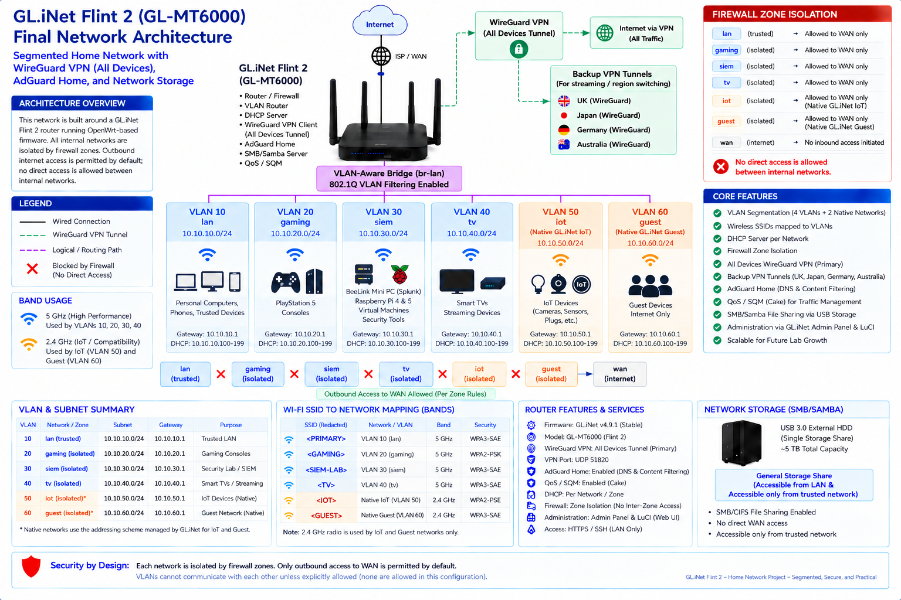

# GL.iNet Flint 2 — Segmented Home Network & Cybersecurity Lab



## Overview

This project is my documentation of the final working configuration of my **GL.iNet Flint 2 (GL-MT6000)** which I used as the central router, firewall, VPN gateway, DNS-filtering platform, and network-storage endpoint for a segmented home network and SIEM lab.

My final design separates trusted devices on the main home LAN, gaming consoles, systems that are part of my home SIEM lab, smart TVs, IoT devices, and guests from each other for both security and QoS purposes. Four custom VLANs I manually created are combined with GL.iNet's native IoT and Guest networks, with firewall zones enforcing isolation between all internal network segments other than the primary home network, which also serves as the management network for the entire networking scheme including all other VLANs.

An early attempt at per-VLAN WireGuard policy did not become a reliable working configuration, even though the WireGuard tunnel itself was functional. The final architecture instead uses the stable **All Devices** VPN policy and documents the failed approach as part of the troubleshooting process.

## Technologies & Concepts

- GL.iNet Flint 2/GL-MT6000, firmware version 4.9.1
- OpenWrt/LuCI and GL.iNet Admin Panel
- IEEE 802.1Q VLANs and Linux bridge VLAN filtering
- IPv4 subnetting, DHCP, and DNS
- Firewall zones and inter-network isolation
- WireGuard/NordVPN
- Policy-based VPN routing troubleshooting
- AdGuard Home and DNS/content filtering
- QoS/traffic management
- SMB/Samba network storage
- Linux routing/firewall diagnostics

## Final Network Segmentation

| VLAN | Network | Subnet | Role | Wireless |
|---:|---|---|---|---|
| 10 | `lan` | `10.10.10.0/24` | Trusted LAN | 5 GHz / WPA3-SAE |
| 20 | `gaming` | `10.10.20.0/24` | Gaming consoles | 5 GHz / WPA2-PSK |
| 30 | `siem` | `10.10.30.0/24` | SIEM / security lab | 5 GHz / WPA3-SAE |
| 40 | `tv` | `10.10.40.0/24` | Smart TVs / streaming | 5 GHz / WPA2-PSK/WPA3-SAE mixed |
| 50 | Native GL.iNet IoT | `10.10.50.0/24` | IoT devices | 2.4 GHz / WPA/WPA2-PSK mixed |
| 60 | Native GL.iNet Guest | `10.10.60.0/24` | Guest Internet access | 2.4 GHz / WPA3-SAE |

> Actual SSID names and credentials are intentionally omitted from this public documentation.

## Physical Port Mapping

| Port | Final Role |
|---|---|
| WAN | ISP uplink; not part of `br-lan` |
| LAN1 | Untagged VLAN 10 / trusted management fallback |
| LAN2 | Untagged VLAN 20 / gaming |
| LAN3 | Untagged VLAN 30 / SIEM lab |
| LAN4 | Untagged VLAN 40 / TV |
| LAN5 | Unassigned |

## Firewall Architecture

Segmentation is also enforced through separate firewall zones rather than relying on different subnets alone.

| Zone | Input | Output | Forward |
|---|---|---|---|
| `lan` | ACCEPT | ACCEPT | ACCEPT |
| `gaming` | REJECT | ACCEPT | REJECT |
| `siem` | REJECT | ACCEPT | REJECT |
| `tv` | REJECT | ACCEPT | REJECT |
| `iot` | REJECT | ACCEPT | REJECT |
| `guest` | REJECT | ACCEPT | REJECT |
| `wan` | DROP | ACCEPT | REJECT |

The isolated zones receive explicit outbound forwarding while remaining separated from other internal networks. Required services local to the router, such as DHCP and DNS, are permitted where needed.

## WireGuard VPN

The final working model uses GL.iNet's **All Devices** policy. Only one tunnel is active at a time:

- Primary U.S. tunnel
- UK tunnel
- Japan tunnel
- Germany tunnel
- Australia tunnel

The regional alternatives are primarily for location-switching purposes for streaming.

### Per-VLAN routing investigation

Per-VLAN VPN routing was initially attempted but did not end up working correctly as intended. Originally, I had wanted to implement tunnels that applied to each individual VLAN, but due to limitations with the GL.iNet VPN policy manager, the tunnels would launch and run, but traffic would not be routed from the devices on each VLAN to its tunnel because of my custom editing of the br-lan device. In-depth investigation through SSH and viewing of runtime logs showed that device traffic would be routed to the policy manager, but was never flagged correctly due to older, stale VPN artifacts left behind from an earlier VPN configuration attempt, thus bypassing the actual VPN tunnel itself. This forced me to either change my entire VLAN architecture, or simply use an "All Devices" policy instead. The tunnel worked fine under **All Devices**, which proved that WireGuard itself was fully operational, and further testing confirmed that the VPN tunnel was functioning correctly on devices across all VLANs.

A particularly useful diagnostic was running:

```bash
ip route get 1.1.1.1
```

Policy inspection also exposed a stale/invalid interface state represented as `noneif` in the `TUNNEL8220_ROUTE_POLICY` chain.

The final decision was to keep the stable and working "All Devices" VPN tunnel architecture rather than add additional complexity for a feature that was not ultimately required, and provided limited security benefits.

## AdGuard Home & Content Filtering

AdGuard Home provides DNS/content filtering across the entire network at the router level. My final configuration favors a relatively lightweight general filtering setup supplemented by security-oriented lists rather than maximizing with a large rule count, since the router is also responsible for handling many other tasks simultaneously.

A practical lesson from testing was that more filtering is not automatically better. False positives, compatibility, CPU load, and the overall operational value all matter.

## QoS

QoS remains part of the final router configuration for traffic management. It is a performance control, rather than a security feature. This was implemented to optimize traffic flow a little better during periods of heavy congestion when multiple devices are all using bandwidth.

## SMB / Samba Storage

A **Silicon Power 5 TB A62L USB 3.0 external HDD**, formatted as a single EXT4 filesystem, is attached to the Flint 2 and shared through SMB/Samba. WAN Samba access is disabled, anonymous access is disabled, and only the main home LAN network is allowed access to the shared network storage.

Note: The GL.iNET Network Storage interface incorrectly displays this drive's size as 36.39 TB, despite it being much smaller. It's true size, after formatting, is 4.96 TB, and this is verified when viewed by local devices when they access the Samba share.

## Administration

Both management interfaces were important:

- **GL.iNet Admin Panel** for GL.iNet-specific services, VPN configuration, network storage implementation, and other general administration tasks.
- **OpenWrt LuCI** for bridge VLAN filtering, firewall configuration/inspection, and lower-level networking tasks such as configuring the wireless SSIDs for each VLAN on the appropriate radio.
- **SSH** for validating routing, interfaces, wireless, and system status.

## Major Lessons Learned

1. **Tunnel establishment and traffic routing are two different problems.** A functioning WireGuard tunnel does not necessarily prove that a device's traffic is using it.
2. **The GUI is an abstraction.** When observed behavior disagrees with the UI, particularly in the LuCI interface, inspect the underlying OpenWrt/Linux state. This was something I noticed often when setting up my wireless settings, because the page would often not allow me to click the Save button, even though the changes were still applied regardless.
3. **VLANs and firewall isolation are distinct concepts.** VLANs segment Layer 2; firewall policy controls Layer-3 communication. Incorrect firewall zone implementation had allowed some traffic between VLANs that were supposed to be isolated, due to specific ports that had been left open for the initial VPN configuration changes I had made in an attempt to get the per-VLAN policy routing to work.
4. **Client compatibility can resemble a network failure.** Wireless authentication compatibility, especially with WPA3-SAE, caused issues with both my PlayStation 5 console and my Roku TV. The PlayStation 5 could see the gaming network's SSID, but could not authenticate or connect to it until I changed the encryption type to WPA2-PSK, which is more broadly supported at this point in time. Similarly, my Roku TV wasn't even able to see the tv LAN's SSID to be able to attempt to connect until I changed it from WPA3-SAE to WPA2-PSK/WPA3-SAE. Both connected and authenticated normally after making this simple change and switching to compatible encryption modes.
5. **Configuration simplicity has operational value.** The stable All Devices VPN design was preferable to an unreliable, more specific policy in the end. Although it didn't accomplish the same goal I originally set, it was a compromise I decided I was willing to make to ensure a stable and reliable network setup.
6. **Resource cost matters.** Aggressive DNS filtering through AdGuard Home increased router workload without necessarily providing proportional benefit. The average CPU temp rose by a noticeable amount during periods of high activity, and in the end I decided the small amount of security/content blocking gain provided by the heavier lists wasn't worth the additional CPU load and temperature increase.

## Validation

The completed build of this network architecture was validated through DHCP/network placement checks, internet connectivity tests, firewall isolation testing, VPN versus public-IP verification, wireless client connectivity testing, and by testing access to the SMB share drive.

## Repository Structure

```text
.
├── README.md
├── PROJECT_STATUS.md
├── LICENSE
├── .gitignore
│
├── diagrams/
│   └── final-network-architecture.png
│
├── images/
│   └── screenshots/
│       ├── adguard-home-dashboard.png
│       ├── admin-panel.png
│       ├── bridge-vlan-filtering.png
│       ├── firewall-zones.png
│       ├── interfaces.png
│       ├── network-storage.png
│       ├── vpn-dashboard.png
│       └── wireless-dashboard.png
│
├── configs/
│   ├── README.md
│   ├── dhcp.conf
│   ├── firewall.conf
│   ├── network.conf
│   ├── samba4.conf
│   └── wireless.conf
│
├── command output/
│   ├── devstatus-br-lan.txt
│   ├── ip-addr.txt
│   ├── ip-route.txt
│   ├── uci-show-dhcp.txt
│   ├── uci-show-firewall.txt
│   ├── uci-show-network.txt
│   └── uci-show-wireless.txt
│
└── docs/
    ├── architecture.md
    ├── vlan-design.md
    ├── firewall.md
    ├── vpn-routing.md
    ├── adguard-home.md
    ├── storage.md
    ├── troubleshooting.md
    └── validation.md
```

## Security / Sanitization

This public repository intentionally excludes passwords, private keys, router/SMB credentials, public WAN addresses, MAC addresses, raw VPN profiles, and complete router configuration exports.

## Outcome

The final Flint 2 build provides a segmented, maintainable, and practical foundation for normal home use and an isolated cybersecurity lab, with room for future expansion and upgrades. More importantly, this project demonstrates practical troubleshooting across OSI Layers 2 and 3, firewall configuration, routing, VPN implementation, DNS filtering, wireless networking, and application-specific boundaries.
